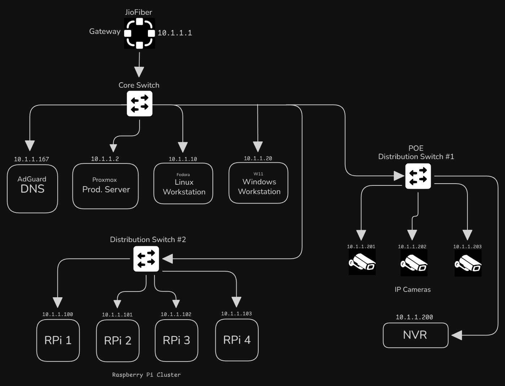
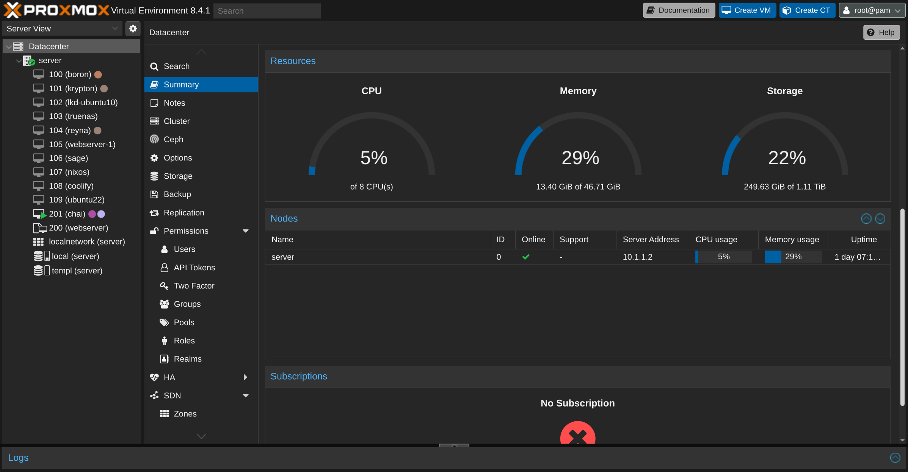
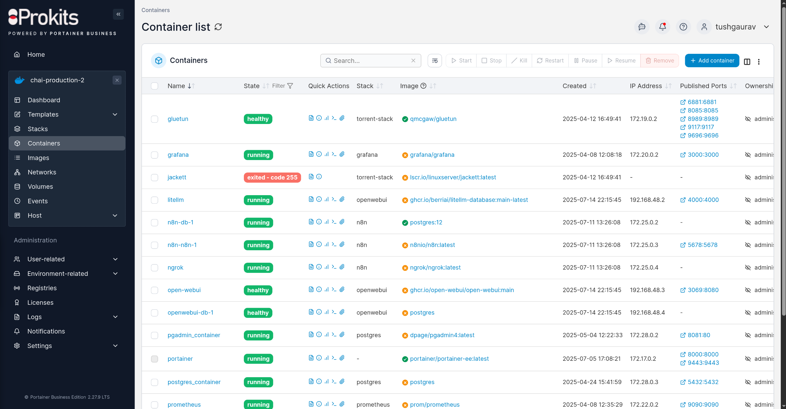

# Tushar's Homelab

Homelab is a laboratory at home where you can self-host, experiment with new technologies, practice for certifications, and so on.

This repo includes my homelab stacks, templates, and configurations files. This is a work in progress, I will be adding more stuff here.

## Overview
### Network Diagram


### Hardware

#### Intel NUC
This is my main Proxmox server. I have 2 Intel NUCs (NUC10FNH) running in a cluster.

- Intel Core i7-10710U
- 80GB SODIMM DDR4 (48 + 32)
- 1 TB NVMe SSD + 512GB NVMe SSD + 512GB HDD (Slow hai)

#### Raspberry Pi 5
This runs a install of Ubuntu Server with Docker. I use this to run my networking stacks.
I have another Raspberry Pi 5 running as a OctoPrint server for my Ender 5 pro.

- Raspberry Pi 5 8GB RAM
- 128GB microSD card

#### Dell Optiplex 3070
This is a testing server. I currently run my Minecraft server on this machine.

- Intel Core i3-6100
- 8GB RAM DDR4
- 256GB SSD

#### Networking
- [TP-Link EasySmart TL-SG108PE](https://www.amazon.in/dp/B00JKB63D8?ref_=ppx_hzsearch_conn_dt_b_fed_asin_title_1)
- [CP Plus PoE CP-DNW-GPU4G2-48-V3](https://www.amazon.in/dp/B0C1CVBJMR?ref_=ppx_hzsearch_conn_dt_b_fed_asin_title_1)
- [Hikvision 8 Port Unmanaged POE Switch](https://www.amazon.in/Hikvision-Unmanaged-Switch-DS-3E0510P-Gigabit/dp/B085S69BZQ/ref=sr_1_2_mod_primary_new?s=computers&sbo=RZvfv%2F%2FHxDF%2BO5021pAnSA%3D%3D&sr=1-2)

#### IoT Devices
- [Google Home Mini](https://www.flipkart.com/google-home-mini-assistant-smart-speaker/p/itmda7458949f970)
- [Philips HSP3500 WiFi Camera](https://www.amazon.in/dp/B0C824LWJB?amp=&amp=)
- [Zebronics ZEB-SP110 WiFi Plug](https://www.amazon.in/Zebronics-ZEB-SP110-Compatible-Assistant-Dedicated/dp/B08F3PTSLZ/ref=sr_1_4?s=home-improvement&sr=1-4)
- [Hikvision DS-2CD1023G0E-I IP Camera](https://www.amazon.in/HIKVISION-Ethernet-IP-Plastic-DS-2CD1023G0E-I/dp/B08XVM3SLN)
- [CP Plus TA21PL3-0360 IP Camera](https://www.amazon.in/dp/B0BHTHZ15Q?ref_=ppx_hzsearch_conn_dt_b_fed_asin_title_2)

## Software

### Tech stack

<table>
    <tr>
        <th>Logo</th>
        <th>Name</th>
        <th>Description</th>
    </tr>
    <tr>
        <td></td>
        <td><a href="https://www.proxmox.com/en/">Proxmox</a></td>
        <td>Open source virtualization platform for running VMs and containers</td>
    </tr>
    <tr>
        <td></td>
        <td><a href="https://www.cloudflare.com">Cloudflare</a></td>
        <td>Tunnel</td>
    </tr>
    <tr>
        <td></td>
        <td><a href="https://www.docker.com">Docker</a></td>
        <td>Running containers</td>
    </tr>
    <tr>
        <td></td>
        <td><a href="https://www.nginx.com">NGINX</a></td>
        <td>Primary web server</td>
    </tr>
    <tr>
        <td></td>
        <td><a href="https://prometheus.io">Prometheus</a></td>
        <td>Systems monitoring and alerting toolkit</td>
    </tr>
    <tr>
        <td></td>
        <td><a href="https://grafana.com">Grafana</a></td>
        <td>Observability platform</td>
    </tr>
    <tr>
        <td></td>
        <td><a href="https://tailscale.com">Tailscale</a></td>
        <td>VPN without port forwarding</td>
    </tr>
    <tr>
        <td></td>
        <td><a href="https://adguard.com/en/adguard-home/overview.html">AdGuard Home</a></td>
        <td>Primary DNS and ads blocker</td>
    </tr>
    <tr>
        <td></td>
        <td><a href="https://grafana.com/oss/loki/">Grafana Loki</a></td>
        <td>Log aggregation system</td>
    </tr>
    <tr>
        <td></td>
        <td><a href="https://www.influxdata.com/products/influxdb/">InfluxDB</a></td>
        <td>Time series database for metrics and events</td>
    </tr>
</table>

### Services Running
<table>
    <tr>
        <th>Logo</th>
        <th>Name</th>
        <th>Description</th>
    </tr>
    <tr>
        <td></td>
        <td><a href="https://n8n.io">n8n</a></td>
        <td>Workflow automation tool</td>
    </tr>
    <tr>
        <td></td>
        <td><a href="https://coolify.io">Coolify</a></td>
        <td>Self-hosted Heroku/Netlify alternative</td>
    </tr>
    <tr>
        <td></td>
        <td><a href="https://github.com/portainer/portainer">Portainer</a></td>
        <td>Container management UI</td>
    </tr>
    <tr>
        <td></td>
        <td><a href="https://www.home-assistant.io">Home Assistant</a></td>
        <td>Open source home automation</td>
    </tr>
    <tr>
        <td></td>
        <td><a href="https://github.com/Stirling-Tools/Stirling-PDF">Stirling PDF</a></td>
        <td>PDF manipulation tool</td>
    </tr>
    <tr>
        <td></td>
        <td><a href="https://github.com/qbittorrent">qBittorrent</a></td>
        <td>Web UI for qBittorent</td>
    </tr>
    <tr>
        <td></td>
        <td><a href="https://www.postgresql.org/">PostgreSQL</a></td>
        <td>Primary database</td>
    </tr> 
    <tr>
        <td></td>
        <td><a href="https://mosquitto.org/">Eclipse Mosquitto</a></td>
        <td>MQTT message broker for IoT devices</td>
    </tr>
    <tr>
        <td></td>
        <td><a href="https://www.influxdata.com/products/influxdb/">InfluxDB 3 Core</a></td>
        <td>Time series database for storing metrics and sensor data</td>
    </tr>
    <tr>
        <td></td>
        <td><a href="https://github.com/InfluxCommunity/influxdb3-ui">InfluxDB Explorer</a></td>
        <td>Web UI for viewing and querying InfluxDB data</td>
    </tr>
</table>


### Architecture

Most of my services are running on my Proxmox server. 

#### Proxmox

I have a few VMs running on my Proxmox server. For running individual services, I use Docker containers.



The most important VM is the `chai` (ID: 201), It runs all the critical containers. It's a 8 core 12 GB RAM VM, I have allocated 64GB of disk space to it. This VM is running Ubuntu Server 24.04 LTS with Docker installed.

For managing my containers. I use [Portainer](https://www.portainer.io/). It's a simple UI for managing my containers. 



## Usefull Resources

[Docker Install Script](https://github.com/docker/docker-install)
```
curl -fsSL https://get.docker.com -o get-docker.sh
sh get-docker.sh
``` 
